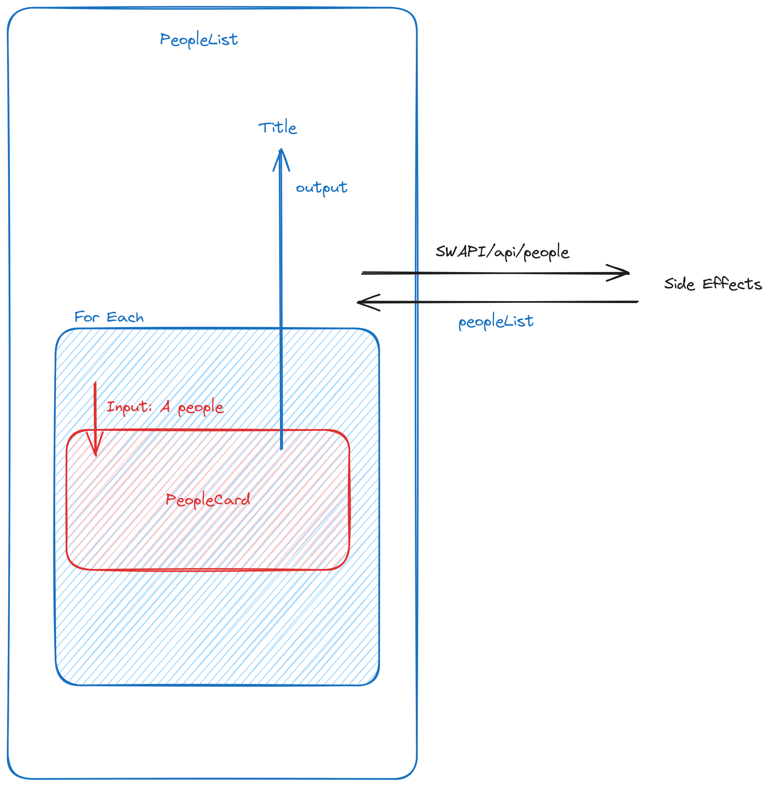

# Display list of starwars people

# architecture

### PeopleList

People list is a container component, his responsibility is to get the people list, and to delegate display of each people to component peopleCard

People List display in his title the selected people

**_Container component could have state_**

### PeopleCard

People card his a dumb component, which get in input a people object and emit the name of the selected component.

**_Dumb component shouldn't have state that depends on his inputs_**

### State vs Store

State instance are unique for a component.

You can share state logic between component but state will be different and unique for each component

To Share state between componenet you should use a store

in React: redux or mobx
in vue: pinia (built-in)
